<div align="center">

# 英雄联盟业余联赛平台


<br/>

**一款面向英雄联盟业余玩家的完整联赛管理平台**

支持 Web 端 + Flutter App 双端，涵盖选手注册、战队管理、约战系统、战绩统计、排行榜等核心功能。

[演示视频](#) · [API 文档](http://localhost:3000/docs) · [提交 Issue](https://github.com/pener5577/lol-league/issues)

</div>

---

## 📸 界面预览

### Web 端

| 首页 | 选手中心 | 战队中心 |
|------|---------|---------|
| 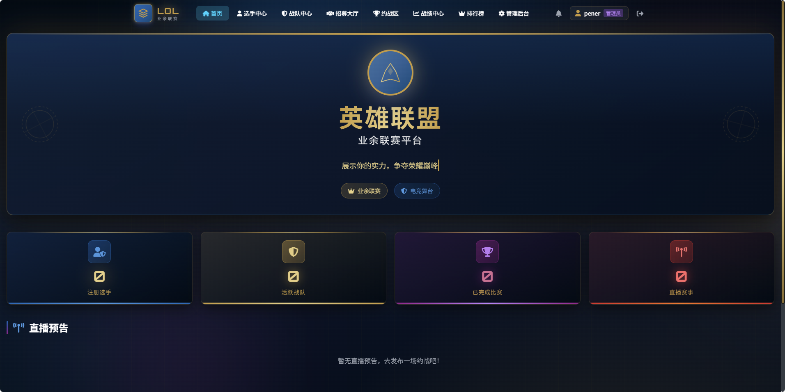 | 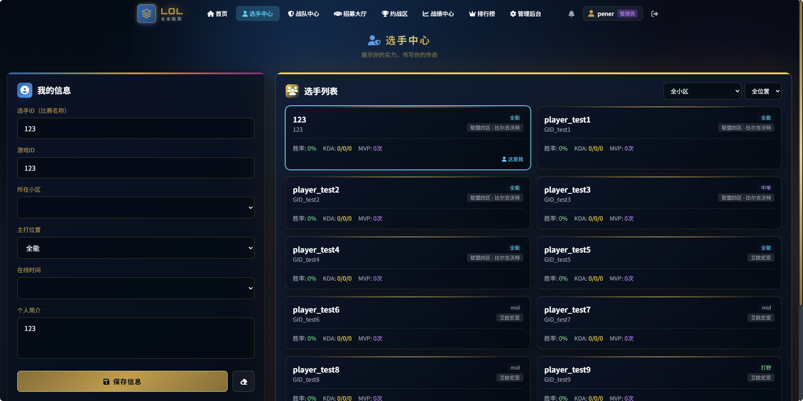 | 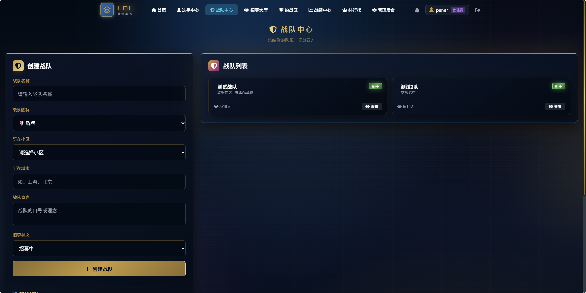 |

| 招募大厅 | 约战区 | 战绩中心 |
|---------|--------|---------|
| 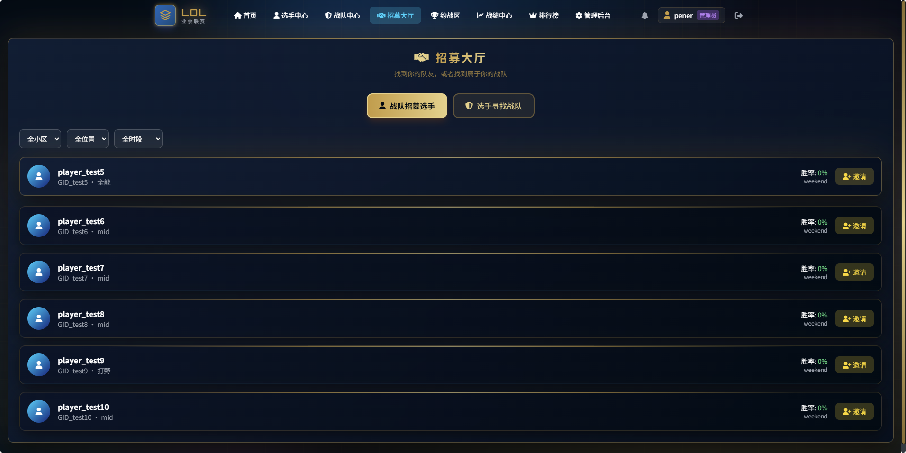 | 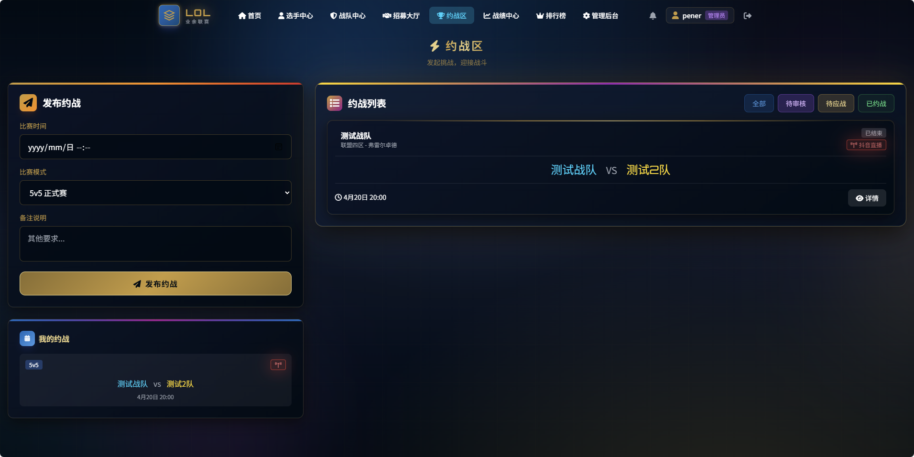 | 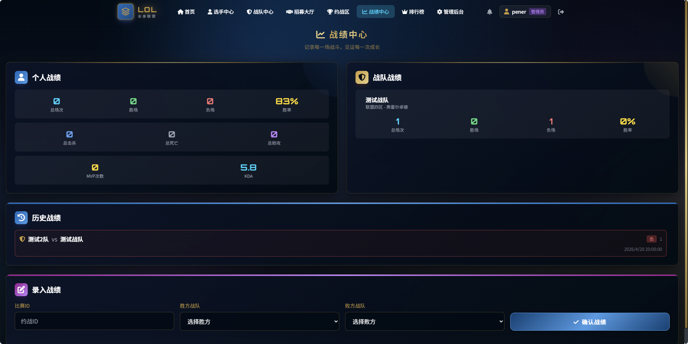 |

| 排行榜 | 管理后台 |
|--------|---------|
| 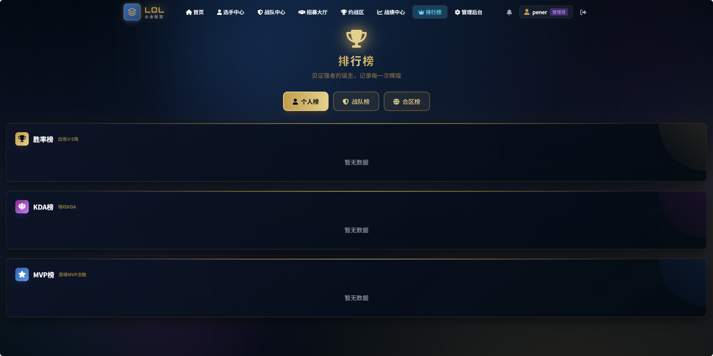 | 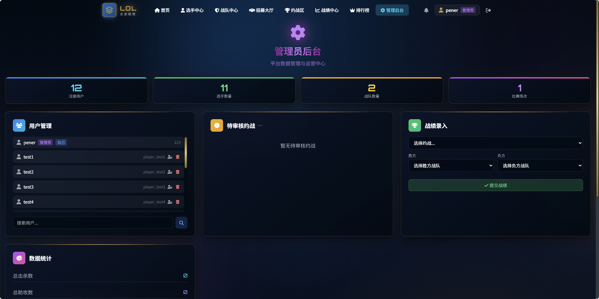 |

### Flutter App 端

| 登录 | 首页 | 排行榜 | 约战大厅 | 招募大厅 | 个人中心 |
|------|------|--------|---------|---------|---------|
| 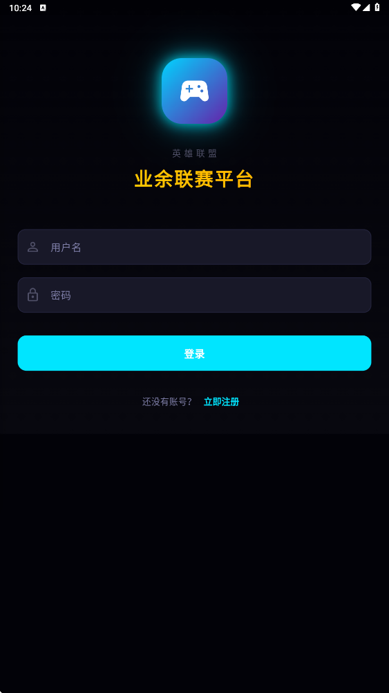 | 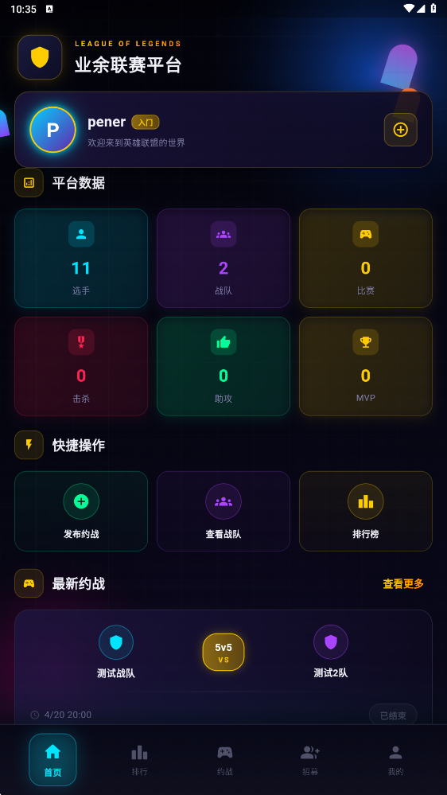 | 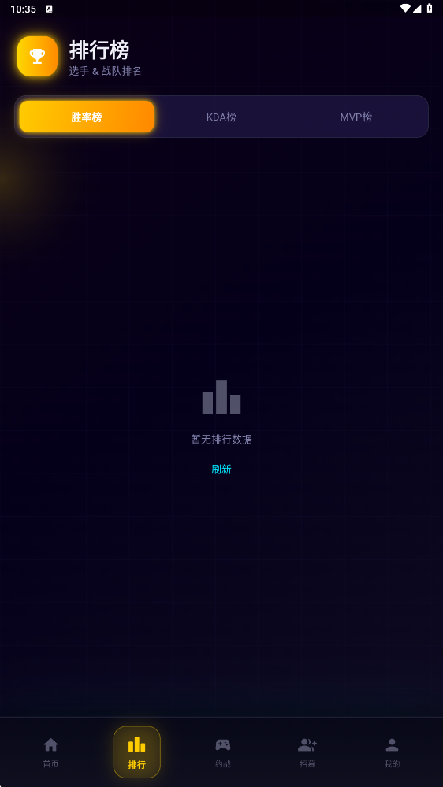 | 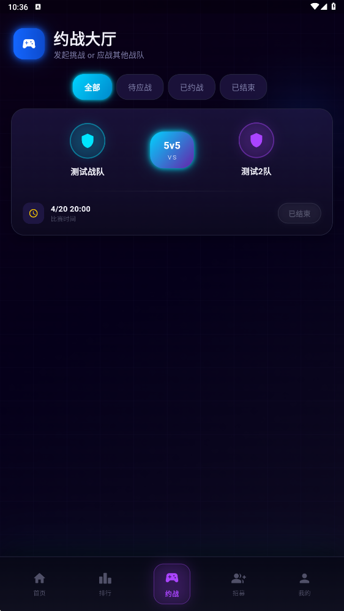 | 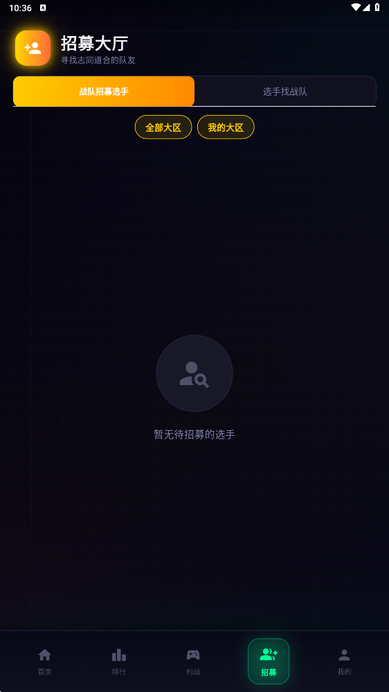 | 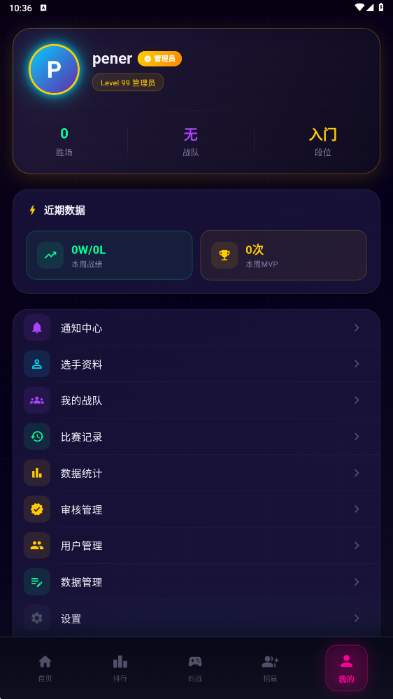 |

> 💡 **界面风格**：英雄联盟赛事级别电竞主题，采用深色背景 + 金色/蓝色/青色霓虹光效，磨砂玻璃卡片设计。

---

## ✨ 功能特性

### 用户系统
- JWT 认证，支持 7 天 Token 有效期
- 管理员 / 普通用户双角色权限体系
- 用户注册时支持邀请码（可选）

### 选手中心
- 选手档案：召唤师名、游戏 ID、所在大区/小区、惯用位置
- 按大区/位置筛选，支持搜索
- 展示个人战绩：总场次、胜场、负场、胜率、KDA、MVP 次数

### 战队系统
- 创建/解散战队，设置战队 logo、宣言、招募状态
- 队长权限：邀请选手、踢出成员
- 同大区限制（只能加入同大区战队）
- 战队积分、胜负记录、连胜数追踪

### 约战系统
- 发布约战（选择模式/时间/备注）
- **双重审核流程**：管理员审核 → 对手应战
- 大区内匹配，自动过滤不同大区约战
- 队长可上传战绩截图
- 完整状态流转：待审核 → 待应战 → 已约战 → 已结束

### 战绩统计
- 管理员录入比赛结果（含选手 KDA 数据）
- 自动计算并更新选手胜率、KDA
- 自动计算 MVP（KDA 最高的选手）
- 战队积分（胜利 +3 分）、连胜记录自动更新

### 排行榜系统
- **选手榜**：胜率榜 / KDA 榜 / MVP 榜（≥5 场次才上榜）
- **战队榜**：积分榜 / 连胜榜
- **大区榜**：各大区选手积分对比

### 通知系统
- 战队邀请 / 入队申请 / 约战通知
- 支持接受/拒绝操作
- 未读消息徽章实时更新

### 管理员后台
- 统计概览：用户数、选手数、战队数、比赛场次
- 待审核约战列表，一键批准/驳回（支持填写驳回原因）
- 战绩录入（选择约战 → 选择胜负方 → 填入各选手 KDA）
- 数据管理：直接修改选手/战队统计数据
- 用户管理：设置/取消管理员权限、删除用户、搜索用户
- 数据导出（JSON 格式）

---

## 🏗️ 技术架构

```
┌─────────────────────────────────────────────────────┐
│                      Client                          │
│  ┌─────────────────┐      ┌─────────────────────┐   │
│  │  Web (HTML/JS)  │      │   Flutter App (iOS/  │   │
│  │  Tailwind CSS   │      │   Android/Windows)   │   │
│  │  Font Awesome   │      │   Provider + GoRouter│   │
│  └────────┬────────┘      └──────────┬──────────┘   │
└───────────┼──────────────────────────┼───────────────┘
            │   HTTP / REST API        │
            ▼                          ▼
┌─────────────────────────────────────────────────────┐
│               Backend (FastAPI)                      │
│  ┌────────────┐  ┌─────────────┐  ┌──────────────┐  │
│  │   Routers  │  │  JWT Auth   │  │  Middleware   │  │
│  │  (50+ API) │  │  (python-   │  │  (CORS etc.) │  │
│  │            │  │   jose)     │  │              │  │
│  └────────────┘  └─────────────┘  └──────────────┘  │
│  ┌──────────────────────────────────────────────┐    │
│  │           SQLAlchemy ORM                      │    │
│  └──────────────────────────────────────────────┘    │
└────────────────────────┬────────────────────────────┘
                         │
                         ▼
                  ┌─────────────┐
                  │   SQLite    │
                  │ lol-league  │
                  │    .db      │
                  └─────────────┘
```

### 技术栈

| 端 | 技术 | 版本 |
|---|-----|------|
| 后端框架 | FastAPI | 0.109.0 |
| ASGI 服务器 | Uvicorn | 0.27.0 |
| ORM | SQLAlchemy | 2.0.25 |
| 数据验证 | Pydantic | 2.5.3 |
| 认证 | python-jose (JWT) | 3.3.0 |
| 密码加密 | passlib + bcrypt | 1.7.4 |
| 数据库 | SQLite | — |
| 移动端 | Flutter | 3.x |
| 状态管理 | Provider | 6.1.2 |
| 路由 | GoRouter | 14.2.7 |
| HTTP 客户端 | Dio | 5.4.3 |
| 本地存储 | SharedPreferences | 2.2.3 |

---

## 📁 项目结构

```
lol-league/
├── backend/                     # Python FastAPI 后端
│   ├── main.py                 # 主应用，所有 API 路由
│   ├── models.py               # SQLAlchemy ORM 数据模型
│   ├── schemas.py              # Pydantic 请求/响应 Schema
│   ├── database.py             # 数据库连接配置
│   ├── auth.py                 # JWT 认证中间件
│   ├── requirements.txt        # Python 依赖
│   ├── .env.example            # 环境变量示例
│   └── lol-league.db          # SQLite 数据库（自动创建）
│
├── lol_league_app/              # Flutter 移动端应用
│   └── lib/
│       ├── core/               # 核心层
│       │   ├── constants/      # 主题色、常量、大区数据
│       │   ├── network/        # API 客户端（Dio 封装）
│       │   └── storage/        # 本地存储封装
│       ├── data/               # 数据层
│       │   ├── models/         # 数据模型（Player/Team/Match...）
│       │   └── repositories/   # Repository（数据仓库）
│       ├── domain/             # 业务层
│       │   └── providers/      # Provider 状态管理
│       ├── presentation/       # 表现层
│       │   ├── screens/        # 页面（26 个屏幕）
│       │   └── widgets/        # 通用组件库
│       └── routes/             # GoRouter 路由配置
│
├── lol-league.html              # Web 单页应用（4700+ 行）
├── api.js                       # Web 端 API 调用层
├── docs/
│   └── screenshots/             # 界面截图
└── README.md
```

---

## 🚀 快速开始

### 环境要求

- Python 3.12+
- Flutter 3.x（移动端）
- 现代浏览器（Web 端）

### 1. 启动后端

```bash
cd backend

# 安装依赖
pip install -r requirements.txt

# 配置环境变量（可选，有默认值）
cp .env.example .env
# 编辑 .env 设置 SECRET_KEY、ADMIN_USERNAME、ADMIN_PASSWORD

# 启动服务
python main.py
# 或使用 uvicorn：
# uvicorn main:app --host 0.0.0.0 --port 3000 --reload
```

服务器启动后访问：
- **Web 应用**：http://localhost:3000
- **API 文档**：http://localhost:3000/docs
- **ReDoc**：http://localhost:3000/redoc

### 2. 启动 Flutter App

```bash
cd lol_league_app

# 安装依赖
flutter pub get

# 运行（确保后端已启动）
flutter run

# 构建发布版本
flutter build apk           # Android
flutter build ios           # iOS
flutter build windows       # Windows
```

### 3. 使用 Web 端

直接用浏览器打开 http://localhost:3000 即可使用全功能 Web 应用。

---

## ⚙️ 环境变量配置

在 `backend/.env` 文件中配置（参考 `.env.example`）：

| 变量名 | 说明 | 默认值 |
|--------|------|--------|
| `SECRET_KEY` | JWT 签名密钥（生产环境务必修改） | `lol-league-dev-secret-key-...` |
| `ADMIN_USERNAME` | 默认管理员用户名 | 无（不创建） |
| `ADMIN_PASSWORD` | 默认管理员密码 | 无（不创建） |
| `CORS_ORIGINS` | 允许的前端域名，逗号分隔 | 本地常用端口 |

---

## 🗺️ 大区划分

| 大区 | 所含小区 |
|------|---------|
| 艾欧尼亚 | 艾欧尼亚（独立） |
| 黑色玫瑰 | 黑色玫瑰（独立） |
| 峡谷之巅 | 峡谷之巅（独立） |
| 联盟一区 | 祖安、皮尔特沃夫、巨神峰、教育网、男爵领域、均衡教派、影流、守望之海 |
| 联盟二区 | 卡拉曼达、暗影岛、征服之海、诺克萨斯、战争学院、雷瑟守备 |
| 联盟三区 | 班德尔城、裁决之地、水晶之痕、钢铁烈阳、皮城警备 |
| 联盟四区 | 比尔吉沃特、弗雷尔卓德、扭曲丛林 |
| 联盟五区 | 德玛西亚、无畏先锋、恕瑞玛、巨龙之巢 |

> 同大区玩家才能加入同一战队、参与约战匹配。

---

## 🔄 约战流程

```
选手发布约战
     │
     ▼
  [待审核]  ←── 管理员审核
     │
  ┌──┴──┐
 批准   驳回
  │      │
  ▼      ▼
[待应战] [未通过]
  │
  │  ←── 其他战队应战
  ▼
[已约战]
  │
  │  ←── 双方比赛 + 截图上传
  │
  │  ←── 管理员录入战绩
  ▼
[已结束]  → 自动更新选手/战队数据
```

---

## 📡 API 接口总览

### 认证

| 方法 | 路径 | 说明 |
|------|------|------|
| `POST` | `/api/auth/register` | 用户注册 |
| `POST` | `/api/auth/login` | 用户登录 |
| `GET` | `/api/auth/me` | 获取当前用户信息 |

### 选手

| 方法 | 路径 | 说明 |
|------|------|------|
| `GET` | `/api/players` | 获取选手列表（支持大区/位置筛选） |
| `POST` | `/api/players` | 创建/更新我的选手档案 |
| `GET` | `/api/players/me/current` | 获取当前用户的选手 |
| `GET` | `/api/players/rankings/winrate` | 胜率排行榜 |
| `GET` | `/api/players/rankings/kda` | KDA 排行榜 |
| `GET` | `/api/players/rankings/mvp` | MVP 排行榜 |
| `PUT` | `/api/players/{id}/stats` | 更新选手统计 🔒管理员 |

### 战队

| 方法 | 路径 | 说明 |
|------|------|------|
| `GET` | `/api/teams` | 获取战队列表 |
| `POST` | `/api/teams` | 创建战队 |
| `GET` | `/api/teams/{id}` | 获取战队详情（含成员） |
| `DELETE` | `/api/teams/{id}` | 解散战队（队长） |
| `POST` | `/api/teams/{id}/recruit` | 申请加入战队 |
| `POST` | `/api/teams/{id}/leave` | 退出战队 |
| `POST` | `/api/teams/{id}/invite` | 邀请选手（队长） |
| `POST` | `/api/teams/{id}/kick` | 踢出成员（队长） |
| `GET` | `/api/teams/rankings/score` | 积分排行榜 |
| `GET` | `/api/teams/rankings/winStreak` | 连胜排行榜 |
| `PUT` | `/api/teams/{id}/stats` | 更新战队统计 🔒管理员 |

### 约战

| 方法 | 路径 | 说明 |
|------|------|------|
| `GET` | `/api/matches` | 获取约战列表 |
| `POST` | `/api/matches` | 发布约战 |
| `GET` | `/api/matches/{id}` | 获取约战详情 |
| `POST` | `/api/matches/{id}/review` | 审核约战 🔒管理员 |
| `POST` | `/api/matches/{id}/accept` | 应战（接受约战） |
| `POST` | `/api/matches/{id}/cancel` | 取消约战 |
| `POST` | `/api/matches/{id}/screenshot` | 上传战绩截图 |
| `POST` | `/api/matches/{id}/result` | 录入战绩 🔒管理员 |
| `GET` | `/api/matches/results/list` | 历史战绩列表 |

### 通知

| 方法 | 路径 | 说明 |
|------|------|------|
| `GET` | `/api/notifications` | 获取通知列表 |
| `PUT` | `/api/notifications/{id}` | 更新通知状态（已读/接受/拒绝） |
| `GET` | `/api/notifications/unread-count` | 获取未读数量 |

### 用户管理 🔒管理员

| 方法 | 路径 | 说明 |
|------|------|------|
| `GET` | `/api/users` | 获取用户列表 |
| `PUT` | `/api/users/{id}/admin` | 设置/取消管理员 |
| `DELETE` | `/api/users/{id}` | 删除用户 |

### 统计

| 方法 | 路径 | 说明 |
|------|------|------|
| `GET` | `/api/stats/public` | 公开统计数据（无需登录） |
| `GET` | `/api/stats/overview` | 管理统计概览 🔒登录 |
| `POST` | `/api/stats/reset` | 重置所有数据 🔒管理员 |
| `POST` | `/api/stats/clear-results` | 清空战绩记录 🔒管理员 |

---

## 🗄️ 数据模型

### User（用户）

| 字段 | 类型 | 说明 |
|------|------|------|
| id | Integer | 主键 |
| username | String | 用户名（唯一） |
| hashed_password | String | bcrypt 加密密码 |
| is_admin | Boolean | 是否管理员 |
| created_at | DateTime | 注册时间 |

### Player（选手）

| 字段 | 类型 | 说明 |
|------|------|------|
| id | Integer | 主键 |
| user_id | Integer | 关联用户 |
| team_id | Integer | 所属战队（可空） |
| match_name | String | 召唤师名 |
| game_id | String | 游戏 ID |
| region_group | String | 大区 |
| region_small | String | 小区 |
| position | String | 位置 |
| wins/losses | Integer | 胜负场 |
| kills/deaths/assists | Integer | 总击杀/死亡/助攻 |
| games_played | Integer | 总场次 |
| win_rate | Float | 胜率（自动计算） |
| kda | Float | KDA（自动计算） |
| mvp_count | Integer | MVP 次数 |
| win_streak | Integer | 当前连胜 |

### Team（战队）

| 字段 | 类型 | 说明 |
|------|------|------|
| id | Integer | 主键 |
| name | String | 战队名 |
| captain_id | Integer | 队长选手 ID |
| region_group | String | 大区 |
| region_small | String | 小区 |
| logo | String | 图标（Font Awesome 类名） |
| description | String | 战队宣言 |
| level | String | 等级（新手/精英/王牌） |
| wins/losses | Integer | 胜负场 |
| win_streak | Integer | 连胜数 |
| score | Integer | 积分（胜+3分） |
| recruit_status | String | 招募状态 |

### Match（约战）

| 字段 | 类型 | 说明 |
|------|------|------|
| id | Integer | 主键 |
| team_id | Integer | 发起战队 |
| opponent_id | Integer | 应对战队（可空） |
| mode | String | 模式（5v5/3v3） |
| time | DateTime | 约战时间 |
| status | String | 状态（见下表） |
| winner_id/loser_id | Integer | 胜负方 |
| mvp_player_id | Integer | MVP 选手 |
| screenshot | Text | 战绩截图（Base64） |
| reject_reason | String | 驳回原因 |

**约战状态值：**

| 状态值 | 含义 |
|--------|------|
| `待审核` | 已发布，等待管理员审核 |
| `待应战` | 审核通过，等待对手应战 |
| `已约战` | 对手已应战，等待比赛 |
| `已结束` | 战绩已录入 |
| `未通过` | 管理员驳回 |
| `已取消` | 发起方取消 |

---

## 🔒 权限说明

| 功能 | 游客 | 登录用户 | 队长 | 管理员 |
|------|:----:|:--------:|:----:|:------:|
| 查看选手/战队列表 | ✅ | ✅ | ✅ | ✅ |
| 查看排行榜 | ✅ | ✅ | ✅ | ✅ |
| 注册选手档案 | ❌ | ✅ | ✅ | ✅ |
| 创建战队 | ❌ | ✅ | ✅ | ✅ |
| 邀请/踢出成员 | ❌ | ❌ | ✅ | ✅ |
| 发布约战 | ❌ | ✅（有战队） | ✅ | ✅ |
| 应战 | ❌ | ✅（有战队） | ✅ | ✅ |
| 审核约战 | ❌ | ❌ | ❌ | ✅ |
| 录入战绩 | ❌ | ❌ | ❌ | ✅ |
| 用户管理 | ❌ | ❌ | ❌ | ✅ |

---

## 🐛 已知问题 & 开发计划

### 近期已修复
- [x] Web 端 `currentPlayerId` 字符串/数字类型不匹配导致战队查找失败
- [x] 管理后台 `resultMatchSelect` 变量重复声明导致 SyntaxError
- [x] 战绩录入后 `win_rate`/`kda` 字段不自动更新
- [x] 历史战绩列表始终为空（API 返回结构解析错误）
- [x] 直播赛事计数器始终显示 0
- [x] 战队详情页 UI 缺少电竞主题样式（Flutter）
- [x] 个人中心战队名称显示 "战队ID: xx" 而非战队名（Flutter）
- [x] 约战大厅大区筛选器仅显示 4 个大区（Flutter）

### 开发计划
- [ ] 添加选手/战队搜索功能
- [ ] 加入赛程日历视图
- [ ] 战绩截图在线预览
- [ ] 支持 MySQL/PostgreSQL 数据库
- [ ] Docker 一键部署

---

## 🤝 贡献

欢迎提交 Issue 和 Pull Request！

1. Fork 本仓库
2. 创建功能分支 `git checkout -b feature/your-feature`
3. 提交修改 `git commit -m 'feat: add your feature'`
4. 推送分支 `git push origin feature/your-feature`
5. 创建 Pull Request

---

## 📄 License

[MIT](LICENSE) © 2024 pener5577
